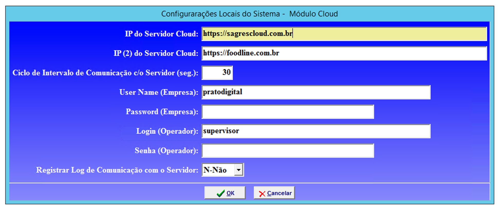

# Sagres Cloud

Sagres cloud é um sistema desenvolvido para gestão dos restaurantes nas nuvens.

## Instalação

### No servidor Sagres Cloud

- Criar o Cliente no Sistema

  

- Por padrão está sendo utilizando na `Identificação` o CNPJ da empresa que será usado para logar.

- F5 para criar o banco de dados inicial da empresa. Após essa passo será gerado uma pasta exemplo: `Cliente00000x`. Aqui que deve ser jogado os dados do cliente.

- Até o momento deve ser copiar a tabela `SessoesClienteSistema` de outro cliente para que funcione, correção paleative.

### Clientes Antigos

Para clientes antigos deve-se:

Gestão:
- Ter o sistema atualizado na última versão
- Alterar na tabela `Configur` o campo `ModuloSagresCloud` para `1`
- Copiar a pasta DADOS do gestão para o Servidor Cloud

NFCe:
- Ter o sistema atualizado na última versão
- Alterar na tabela `Configur` o campo `ModuloSagresCloud` para `1`
- Ir no `NFCe` > `Configurações` > `Opções Locais do Sistema` > `Cloud (Integração c/ Servidor Remoto)` e realizar a configuração.
  

Após fazer as configurações não esquecer de tirar o Server do Ar, do inicializar e o atalho do remoto da área de trabalho

### Clientes Novos

Para clientes novos:

- Atualmente, deve-se criar um banco de dados do gestão normal, e copiar as tabelas, vazias mesmo, seguindo o mesmo processo acima.

## Ferramentas

## 📝 Licença
Esse projeto está sob licença. Veja o arquivo [LICENÇA](LICENSE.md) para mais detalhes.